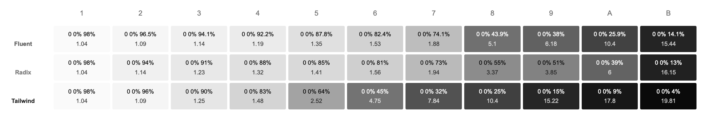

颜色在设计中占据至关重要的作用，必须好好搞清楚。

[color](https://www.radix-ui.com/themes/docs/theme/color)

[dark-mode](https://www.radix-ui.com/themes/docs/theme/dark-mode)

> Do not depend on color to communicate meaning.

## HSL 与 Contrast 的关系

颜色的色相（Hue）、饱和度（Saturation）和亮度（Lightness）和 [Color contrast](https://developer.mozilla.org/en-US/docs/Web/Accessibility/Understanding_WCAG/Perceivable/Color_contrast) 都有关系。

### 色相 Hue

蓝 > 红 > 绿 > 黄

| 颜色 | HSL | HEX | Contrast |
| --- | --- | --- | --- |
| <strong style={{color: 'hsl(0 100% 50%)'}}>█ Red</strong> | `hsl(0 100% 50%)` | `#f00` | 3.99 / AALarge |
| <strong style={{color: 'hsl(30 100% 50%)'}}>█ Orange</strong> | `hsl(30 100% 50%)` | `#ff8000` | 2.52 |
| <strong style={{color: 'hsl(60 100% 50%)'}}>█ Yellow</strong> | `hsl(60 100% 50%)` | `#ff0` | 1.07 |
| <strong style={{color: 'hsl(90 100% 50%)'}}>█ Lime</strong> | `hsl(90 100% 50%)` | `#80ff00` | 1.29 |
| <strong style={{color: 'hsl(120 100% 50%)'}}>█ Green</strong> | `hsl(120 100% 50%)` | `#0f0` | 1.37 |
| <strong style={{color: 'hsl(150 100% 50%)'}}>█ Emerald</strong> | `hsl(150 100% 50%)` | `#00ff80` | 1.34 |
| <strong style={{color: 'hsl(180 100% 50%)'}}>█ Cyan</strong> | `hsl(180 100% 50%)` | `#0ff` | 1.25 |
| <strong style={{color: 'hsl(210 100% 50%)'}}>█ Sky</strong> | `hsl(210 100% 50%)` | `#0080ff` | 3.79 / AALarge |
| <strong style={{color: 'hsl(240 100% 50%)'}}>█ Blue</strong> | `hsl(240 100% 50%)` | `#00f` | 8.61 / AAA |
| <strong style={{color: 'hsl(270 100% 50%)'}}>█ Indigo</strong> | `hsl(270 100% 50%)` | `#8000ff` | 6.25 / AA |
| <strong style={{color: 'hsl(300 100% 50%)'}}>█ Violet</strong> | `hsl(300 100% 50%)` | `#f0f` | 3.13 / AALarge |
| <strong style={{color: 'hsl(330 100% 50%)'}}>█ Fuchsia</strong> | `hsl(330 100% 50%)` | `#ff0080` | 3.78 / AALarge |

### 饱和度 Saturation

结合 `hue` 才能看出 `saturation` 对 Contrast 的影响，有的成正比，有的成反比。

* 原色值的 Contrast 低，则降 `saturation` 能提升 Contrast，如黄色
* 原色值的 Contrast 高，则降 `saturation` 会同步降低 Contrast，如蓝色

`saturation` 没有 `lightness` 对 Contract 的影响曲线那么陡峭，比较温和。

### 亮度 Lightness

成反比：`lightness` 越高，Contract 越低：

* `lightness: 0` → `1.0`
* `lightness: 100%` → `21.0`

## 色阶与序号

参考了较多的是  [Microsoft Fluent2](https://fluent2.microsoft.design/color)、 [Radix](https://www.radix-ui.com/colors)、 [Tailwind](https://tailwindcss.com/docs/customizing-colors)。

多数设计都是从浅到深，也有例外，如 [Blueprint](https://blueprintjs.com/docs/#core/colors) 就是从深到浅。

选取单数 11 作为色阶，序号 `1-11`，值越小则相对于主题背景色的色差约小（简单认为越浅）。

黑、白两色比较特殊，但也归类与灰色，因此灰色比较特殊，除了 `1-11`，还有 `0`（白）和 `12`（黑）。

## 灰色

> 灰色多作文字、背景、边框

对比了几个 11、12 阶色盘后，`kcuf-ui` 借鉴了 [fluent](https://fluent2.microsoft.design/color) 的灰色色阶。

| # | Css Var  | Contrast | 作用 |
| ---- |---| ---- | ---- |
| 0 | `-kc-gray-0` | 1.00 | （白色）背景层级 1 |
| 1 | `-kc-gray-1` | 1.01-1.04 | 背景层级 2 |
| 2 | `-kc-gray-2` | 1.07-1.08 | 背景层级 3（默认） |
| 3 | `-kc-gray-3` | 1.14-1.15 | 背景层级 4 / 装饰性边框，用于非重要元素 |
| 4 | `-kc-gray-4` | 1.19-1.21 | 装饰性边框，用于非重要元素 |
| 5 | `-kc-gray-5` | 1.33-1.35 | 装饰性边框，用于非重要元素 / 组件边框，如表单控件 |
| 6 | `-kc-gray-6` | 1.5-1.53 | 组件边框，如表单控件 |
| 7 | `-kc-gray-7` | 1.88-1.9 | 禁用文字（不需满足 WCAG） |
| 8 | `-kc-gray-8` | 5.1-5.2 AA✓ | 文字（三级） |
| 9 | `-kc-gray-9` | 6.4-6.6 AA✓ | 文字（次级） |
| 10 | `-kc-gray-10` | 10-10.4 AAA✓ | 文字（默认） |
| 11 | `-kc-gray-11` | 15.3-15.7 AAA✓ | 标题文字 |
| 12 | `-kc-gray-12` | 21.00 AAA✓ | （黑色）保留 |

灰色不一定必须是「真灰色」，即 HSL 的 `S` 为 `0%`，而是可以带一些些饱和度的，可以给用户以偏冷或偏暖的感觉。在设计这些灰色的时候，只需要保证 Contrast 值符合以上范围。

## 彩色

> 彩色为功能色，选取一个作为主色 `Accent`。

| 参考 | 分析 |
| ---- | ---- |
| Fluent | 没有直观的彩色色阶 |
| Radix | 1. 和灰色一样，有较明显的深浅差别<br />2. 同一颜色的色相会有差，给人的感觉是不同颜色拼凑起来 |
| Tailwind | 和灰色一样，递进的色阶 |

鉴于彩色与灰色的作用不同，我决定采用 Tailwind 的方案，实际上多数的设计也采用了类似的方案，比如 Antd 的 10 阶和 Spectrum 的 14 阶。

## 颜色工具

### Web 应用

* [Adobe Color Contrast Analyzer](https://color.adobe.com/zh/create/color-contrast-analyzer) ★★★★★
* [Adobe Color Tools](https://color.adobe.com) ★★★★
* [Color Contrast Check](https://snook.ca/technical/colour_contrast/colour.html) ★★★★
* [ContrastRatioCalculator](https://www.msfw.com/Services/ContrastRatioCalculator) ★★
* [WebAim Contrast Checker](https://webaim.org/resources/contrastchecker/)

### APP

* [Sim Daltonism](https://michelf.ca/projects/sim-daltonism/) ★★★★★ 模拟色盲
* [Color Contrast Analyzer (CCA)](https://www.tpgi.com/color-contrast-checker/) ★★

### NPM 包

| NPM / Git / Home | Stars | 周下载量 | 最近更新 | TS | 说明 |
| --- | --- | --- | --- | --- | :-: |
| [polished](https://www.npmjs.com/package/polished) / [git](https://github.com/styled-components/polished) / [home](https://polished.js.org) | 7.6k | 5,776k | 1Y | ✅ | styled-components 出品 / A11Y `meetsContrastGuidelines / readableColor` |
| [colord](https://www.npmjs.com/package/colord) / [git](https://github.com/styled-components/polished) / [home](https://colord.omgovich.ru) | 1.7k | 8,412k | 2Y | ✅ | 非纯函数式 / 插件 / A11Y `isReadable` |

### 浏览器及插件

* 浏览器 DevTools 一般都有颜色的 A11Y Contrast 检测功能
* [插件 WCAG Contrast checker](https://addons.mozilla.org/en-US/firefox/addon/wcag-contrast-checker)
* [插件 NoCoffee Vision Simulator](https://addons.mozilla.org/en-US/firefox/addon/nocoffee)


## 参考

### 色盘

| Lib | 推荐 | Tokens | 自定义工具 | 说明 |
| ---- | ---- | ---- | ---- | ---- |
| [antd](https://ant.design/docs/spec/colors) | ★ | `1-10`<br />灰 `1-13` | | |
| [atlassian](https://atlassian.design/foundations/color-new/color-palette-new) | ★ | `100-1000`<br />灰色 `0, 100-1000`，外加 5 个透明色 | | |
| [blueprint](https://blueprintjs.com/docs/#core/colors) | ★ | `1-5` | | 🌈 灰色分为浅灰、灰、深灰，格 5 阶，即共有 15 阶灰色 |
| [eui](https://eui.elastic.co/#/theming/colors/values) | ★ | 直接语义化 | | |
| [fluent](https://fluent2.microsoft.design/color) | ★★★★ | 直接语义化 | 灰色 11 阶 + 黑白 | |
| [garden](https://garden.zendesk.com/design/color) | ★★ | `100-800` | | |
| [mantine](https://mantine.dev/theming/colors) | ★★★ | `0-9` | [Mantine Colors Generator](https://mantine.dev/colors-generator) | |
| [mui](https://mui.com/material-ui/customization/color) | ★★ | `50, 100-900` | [Material UI Color Config](https://m2.material.io/inline-tools/color) | |
| [pluralsight](https://design-system.pluralsight.com/core/color) | ★ | `1-10` | | 1-5 为浅色，6-10 为深色，6 为主色 |
| [primer](https://primer.style/foundations/color/base-scales) | ★ | `0-9`<br />white + black | | 🌈 黑白单拎 |
| [radix](https://www.radix-ui.com/colors) | ★★★ | `1-12` | [Radix Custom Palette](https://www.radix-ui.com/colors/custom) | 🎱 主色 #9，所有颜色的用法 |
| [shadcn](https://ui.shadcn.com/colors) | ★★★☆ | `50, 100-900, 950` | | 基于 Tailwind |
| [spectrum](https://spectrum.adobe.com/page/color-palette/) | ★★★★ | `100-1300`<br />灰色 `50, 75, 100-900` | - | 🎱 主色 #700<br />😱 灰色包含白色和黑色<br />🌈 灰色分层 |
| [tailwind](https://tailwindcss.com/docs/customizing-colors) | ★★★★ | `50, 100-900, 950` | | |
| [vuetify](https://vuetifyjs.com/en/styles/colors/#material-colors) | ★ | `xx-lighten-5>1, xx, xx-darken-1>4, xx-accent-1>4` | | |

### 灰色参考

以下分别是 Fluent、Radix 和 Tailwind 的灰色定义：

```ts
const GRAY_FLUENT = [
  'hsl(0 0% 98%)',
  'hsl(0 0% 96.5%)',
  'hsl(0 0% 94.1%)',
  'hsl(0 0% 92.2%)',
  'hsl(0 0% 87.8%)',
  'hsl(0 0% 82.4%)',
  'hsl(0 0% 74.1%)',
  'hsl(0 0% 43.9%)',
  'hsl(0 0% 38%)',
  'hsl(0 0% 25.9%)',
  'hsl(0 0% 14.1%)'
];
const GRAY_RADIX = [ // 去掉它的 1 阶，剩 11 阶
  'hsl(0 0% 98%)',
  'hsl(0 0% 94%)',
  'hsl(0 0% 91%)',
  'hsl(0 0% 88%)',
  'hsl(0 0% 85%)',
  'hsl(0 0% 81%)',
  'hsl(0 0% 73%)',
  'hsl(0 0% 55%)',
  'hsl(0 0% 51%)',
  'hsl(0 0% 39%)',
  'hsl(0 0% 13%)'
];
const GRAY_TAILWIND = [
  'hsl(0 0% 100%)',
  'hsl(0 0% 98%)',
  'hsl(0 0% 96%)',
  'hsl(0 0% 90%)',
  'hsl(0 0% 83%)',
  'hsl(0 0% 64%)',
  'hsl(0 0% 45%)',
  'hsl(0 0% 32%)',
  'hsl(0 0% 25%)',
  'hsl(0 0% 15%)',
  'hsl(0 0% 9%)',
  'hsl(0 0% 4%)'
];
```

展示效果对比如下，其中颜色下方的数字为相对于白色底的 [Contrast](https://developer.mozilla.org/en-US/docs/Web/Accessibility/Understanding_WCAG/Perceivable/Color_contrast)，
展示的字体颜色利用 [plished.readableColor](https://polished.js.org/docs/#readablecolor) 计算得出，如果字体是白色，则说明此灰色符合 WCAG 规范（AA 及以上）：



* **Fluent**
  - 深浅分界清晰，深浅比约 1:2
  - 更容易搭配出层次分明的 UI
  - 深色符合 WCAG 规范
* **Radix**
  - 深浅分界还算清晰，深浅比约 1:2
  - 深色有两个不符合 WCAG
* **Tailwind**
  - 过度平缓，深浅比一半一半

另外 [Adobe Spectrum](https://spectrum.adobe.com/page/color-system/) 对灰色使用场景的说明也很有借鉴意义。

### 彩色参考

* **Fluent**
  - 没有直观的彩色色阶
* **Radix**
  - 和灰色一样，有较明显的深浅差别
  - 同一颜色的色相会有差，给人的感觉是不同颜色拼凑起来
* **Tailwind**
  - 和灰色一样递进的色阶
* **Atlassian**
  - 等差 `lightness`，对称

鉴于彩色与灰色的作用不同，决定采用等差 `lightness` 的方案。多数的设计也采用了类似的方案，比如 Antd 的 10 阶和 Spectrum 的 14 阶。

### 文章和规范

* [A beginner's Guide to Applying Color in UI Design](https://dev.to/georgedoescode/a-beginner-s-guide-to-applying-color-in-ui-design-3904)
* [Building Your Color Palette](https://www.refactoringui.com/previews/building-your-color-palette)
* [Contrast (Minimum) (Level AA)](https://www.w3.org/WAI/WCAG22/Understanding/contrast-minimum.html)
* [Contrast (Enhanced) (Level AAA)](https://www.w3.org/WAI/WCAG21/Understanding/contrast-enhanced.html)
* [WebAIM - Contrast and Color Accessibility](https://webaim.org/articles/contrast)
* [The American Printing House for the Blind Guidelines for Large Printing](https://www.aph.org/app/uploads/2022/04/Research-Based-Large-Print-Guidelines.pdf) 对印刷中的字体、大小、标点、行高、行间距、颜色等很有指导意义
* [Colors in Culture](https://informationisbeautiful.net/visualizations/colours-in-cultures)
